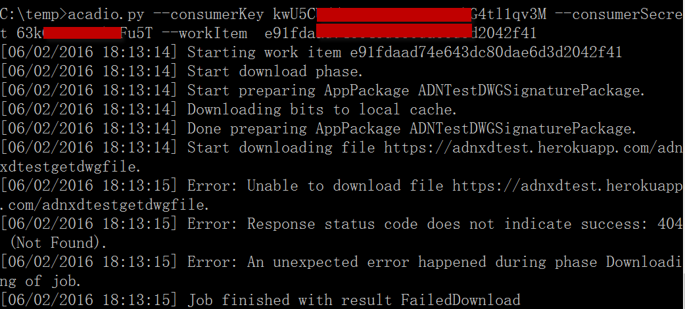

## Design Automation API sample in Python
(Formely AutoCAD I/O).

 

 
 
## Description
This is a Python sample code for <b>Design Automation API</b> (v2). It is a very short demo at this moment which shows get token and check the status of one existing workitem only. More functions will be added in the future.
 
##Setup/Usage Instructions
* Get your credentials of Design Automation API at http://developer.autodesk.com
* Follow the steps on https://developer.autodesk.com/api/autocadio/#sample-codes to create a test codes with full workflow: create activity, create workitem, create app package (if needed). Make a note with the workitem id
* Download [Python](https://www.python.org/downloads/). The code can work with old version such as 2.7, but it is recommended to use the new version.
* run acadio.py with the  credentials and workitem id like:
* * acadio.py --consumerKey [you key] --consumerSecret [your secret] --workItem  [your work item id]
* 

 
 ## License
 These samples are licensed under the terms of the [MIT License](http://opensource.org/licenses/MIT). Please see the [LICENSE](LICENSE) file for full details.
